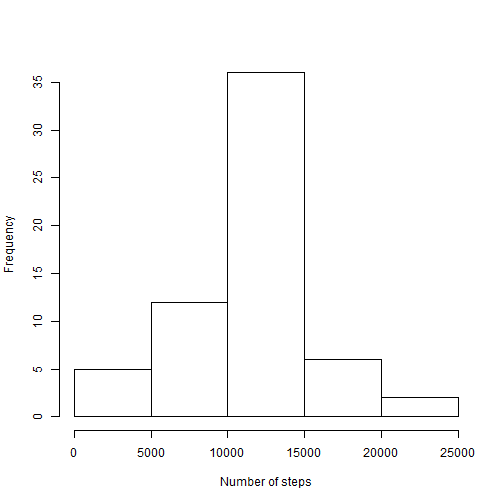

# Reproducible Research: Peer Assessment 1


## Loading and preprocessing the data
Load the *activity.csv* data from *activity.zip* in the current directory into the **raw.data** data frame:

```r
raw.data <- read.csv(unz("activity.zip","activity.csv"), colClasses=c("integer","Date","integer"))
```
No preprocessing is done on the data. But we will verify its basic structure:

```r
str(raw.data)
```

```
## 'data.frame':	17568 obs. of  3 variables:
##  $ steps   : int  NA NA NA NA NA NA NA NA NA NA ...
##  $ date    : Date, format: "2012-10-01" "2012-10-01" ...
##  $ interval: int  0 5 10 15 20 25 30 35 40 45 ...
```


## What is mean total number of steps taken per day?
Start by aggregating the raw data into sums based on the date and display the distribution of the total number of steps taken each day:

```r
date.sum <- aggregate(. ~ date, data=raw.data, FUN=sum)
date.sum$interval <- NULL
hist(date.sum$steps, xlab="Number of steps", main="")
```

 

Now let us look at the mean and median nuber of steps taken each day:

```r
mean(date.sum$steps)
```

```
## [1] 10766
```

```r
median(date.sum$steps)
```

```
## [1] 10765
```

## What is the average daily activity pattern?
Start by aggregating the raw data into averages based on the interval number and display the time series plot of the result:

```r
interval.mean <- aggregate(. ~ interval, data=raw.data, FUN=mean)
interval.mean$date <- NULL
plot(interval.mean, type="l")
```

 

Then calculate the maximum average number of steps taken per 5-minute interval and what interval identifier it corresponds to:

```r
max(interval.mean$steps)
```

```
## [1] 206.2
```

```r
interval.mean[interval.mean$steps == max(interval.mean$steps), "interval"]
```

```
## [1] 835
```

## Imputing missing values
First, let us see how many data entries are missing values:

```r
index <- is.na(raw.data$steps)
sum(index)
```

```
## [1] 2304
```

Next, fill in the the "blanks" with the mean value for the interval identifier and verify that the resulting data set has no missing values:

```r
filled.data <- raw.data
filled.data$steps[index] <- as.numeric(apply(raw.data[index,], MARGIN = 1, FUN = function ( x ) { interval.mean[interval.mean$interval == as.integer(x["interval"]), "steps"] }))
sum(is.na(filled.data$steps))
```

```
## [1] 0
```

Now we can take a look at the distribution of the total number of steps taken each day based on the interpolated data:

```r
filled.sum <- aggregate(. ~ date, data=filled.data, FUN=sum)
filled.sum$interval <- NULL
hist(filled.sum$steps, xlab="Number of steps", main="")
```

 

And also compare the mean and median of the new data set to those of the raw data:

```r
mean(filled.sum$steps)
```

```
## [1] 10766
```

```r
median(filled.sum$steps)
```

```
## [1] 10766
```

As can be seen, there is no change in the mean, but the median has actually reached the mean value.

## Are there differences in activity patterns between weekdays and weekends?
First, create a new factor variable for the **filled.data** data frame to differentiate the weekdays from the weekends and verify that the weekday/weekend assignment has been correct:

```r
filled.data$weekday <- factor(weekdays(filled.data$date) %in% c("Saturday","Sunday"), labels = c("Weekday","Weekend"))
sum(filled.data$weekday[weekdays(filled.data$date) %in% c("Saturday","Sunday")] == "Weekday")
```

```
## [1] 0
```

```r
sum(filled.data$weekday[!(weekdays(filled.data$date) %in% c("Saturday","Sunday"))] == "Weekend")
```

```
## [1] 0
```

Finally, aggregate the data into means based on the interval and weekday value, and look at the difference in the average activity patterns:

```r
weekday.interval.mean <- aggregate(. ~ interval + weekday, data=filled.data, FUN=mean)
weekday.interval.mean$date <- NULL
library(lattice)
xyplot(steps ~ interval | weekday, data=weekday.interval.mean, type="l", layout=c(1,2), xlab="Interval", ylab="Number of steps")
```

 
